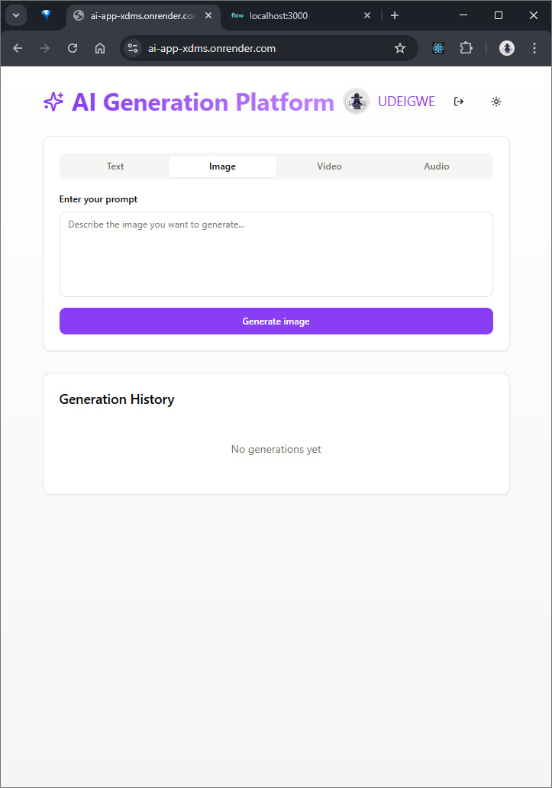
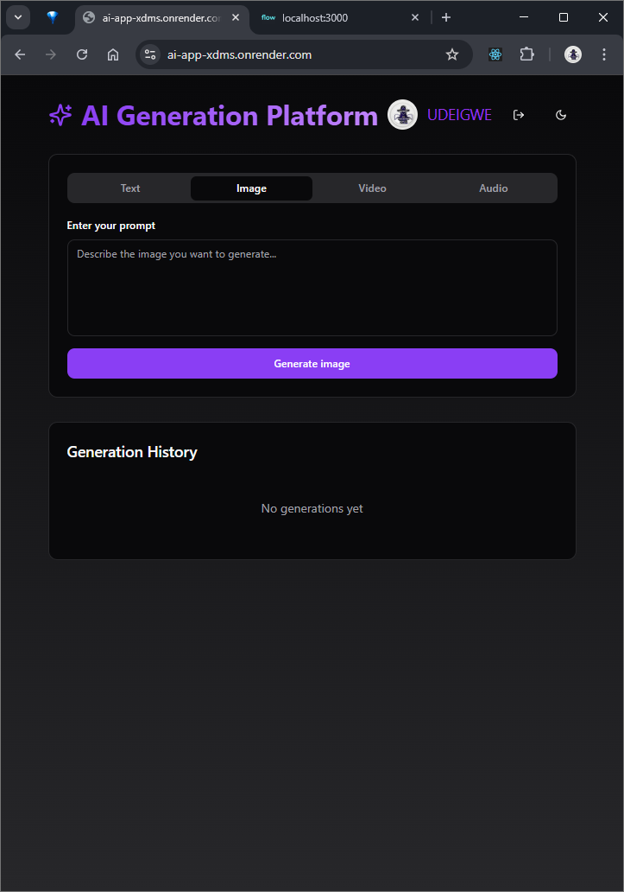

# 🌐 AI Generation Platform


A modern, full-stack web application that uses advanced AI models to generate **text**, **images**, **audio**, and **video** in real time.

Built for creators, artists, and everyday users, the platform provides a sleek and responsive interface that makes it easy to access generative AI tools — all in one place.


## 🚀 Features

- 🔐 Google Sign-In using Firebase Authentication
- 🧠 AI-powered text generation with OpenAI
- 🖼️ Image and video creation using Magic Hour API
- 🔊 Audio generation with OpenAI + Web Speech API
- 👀 Real-time preview of all generated media
- 📁 History tracking stored in browser (localStorage)
- 🌓 Dark and light mode toggle
- 📱 Fully responsive UI for mobile and desktop

## 🧰 Tech Stack

### 🔸 Frontend
- React + TypeScript
- Tailwind CSS
- shadcn/ui (Radix-based UI components)
- TanStack React Query
- Wouter (lightweight routing)
- Firebase Authentication

### 🔹 Backend
- Node.js + Express
- Drizzle ORM (type-safe DB handling)
- dotenv, CORS, tsx, esbuild

### 🔗 API Integrations
- OpenAI – Text and audio generation
- Magic Hour – Image and video generation
- Web Text-to-Speech (TTS) – Audio playback
- Firebase Auth – Google login

## ⚙️ Getting Started

### 1. Clone the repo
```bash
git clone https://github.com/Unknownbosss/AI-APP.git
cd AI-APP
```

### 2. Set up environment variables
Create .env files in the root folder and add this

```
VITE_FIREBASE_API_KEY = your_firebase_api_key
VITE_FIREBASE_PROJECT_ID = your_firebase_project_id
VITE_FIREBASE_APP_ID = your_firebase_app_id
VITE_MAGICHOUR_API_KEY = your_magic_hour_api_key
VITE_OPENAI_API_KEY = your_openai_api_key
```

### 3. Install dependencies

```
npm i
```

### 4. Start the development server

```
npm run dev
```

## Screenshots

| Light Mode                           | Dark Mode                          |
| ------------------------------------ | ---------------------------------- |
|  |  |


## 🙏 Acknowledgements

This project would not have been possible without the support and contributions of the following tools and platforms:

- [OpenAI](https://openai.com/) – for powerful language and audio generation APIs  
- [Magic Hour](https://magic-hour.ai/) – for creative image and video generation  
- [Firebase](https://firebase.google.com/) – for authentication and app infrastructure  
- [shadcn/ui](https://ui.shadcn.com/) – for beautifully crafted UI components  
- [Tailwind CSS](https://tailwindcss.com/) – for utility-first styling  
- [Render](https://render.com/) – for cloud hosting and deployment  
- [TanStack Query](https://tanstack.com/query/latest) – for efficient async state handling  
- The open-source community for inspiration and code samples ❤️


## 📜 License
This project is released under the MIT License.